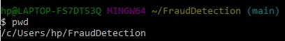
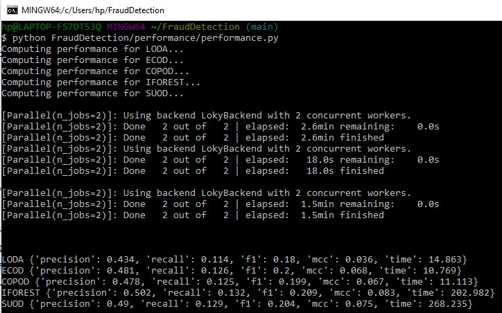

#### Check model performances on the pre-processed dataset
----------------------------------------------------------
We utilized five machine learning (ML) models, namely LODA, ECOD, COPOD, and IFOREST, from the PYOD library to perform our analysis. Further information on these models can be found on the [PYOD](https://pyod.readthedocs.io/en/latest/index.html) website. After preprocessing the dataset, we ran the models and the results are displayed on the Prediction page of our web application. Although it is not recommended to display model performance to users who may not be familiar with the models, we decided to include them for the purpose of this project. To reproduce the performance metrics, follow these steps:

First, ensure that you are in the root directory by running the command on the terminal:
```
cd FraudDetection/
```
The path should look something as follows:



Before proceeding further, it's crucial to confirm that the "preprocessed.csv" file has been successfully generated and stored in the [data](https://github.com/sagnikgh1899/FraudDetection/tree/main/FraudDetection/data) folder. In case the file is missing, there is a need to execute certain commands on the terminal to generate the CSV file. Please refer to the following set of commands that can be run on the terminal to generate the file:
```
python FraudDetection/preprocessing/preprocessing.py
```
After generating the "preprocessed.csv" file, the next step is to evaluate the performance of the machine learning models used for fraud detection in the analysis. To accomplish this, run the following command:
```
python FraudDetection/performance/performance.py
```
Kindly note that the execution of this command will require some time (maximum of 5 minutes) to compute the performance metrics of the 5 models. The output will be similar to the following format:



We have added these values manually to the [models_performance.json](https://github.com/sagnikgh1899/FraudDetection/blob/main/FraudDetection/script/json/models_performance.json) file. While there may be slight variations between the listed values and the ones entered, the differences should be negligible.

----------------------
##### Challenges faced

Initially, the team had planned to implement various machine learning and deep learning models, including LOF, ABOD, KNN, VAE, and MO_GAAL, to improve fraud detection in the dataset. However, the execution time for these models was exceeding 60 minutes, and they were resulting in memory errors, making them computationally heavy for the team's computers. As a result, the team decided to exclude these models from the project.
Additionally, the team had planned to automate the pipeline for writing the model performances directly to the [models_performance.json](https://github.com/sagnikgh1899/FraudDetection/blob/main/FraudDetection/script/json/models_performance.json) file. However, due to time constraints, the team was unable to implement this feature, and the current version requires manually entering the values into the JSON script.

------------------
##### Future Scope
Some potential enhancements that may be included in future releases are:
* Improved performance by integrating powerful yet computationally lightweight fraud detection models, thereby increasing the efficiency and accuracy of fraud detection.
* Implementation of a pipeline that automatically records the model performances directly to the JSON file, reducing the need for manual intervention and improving the overall workflow.
