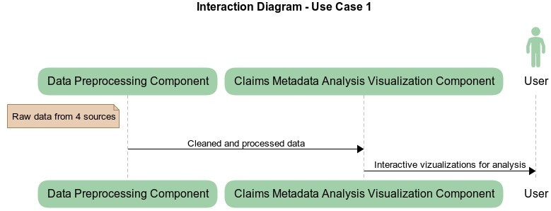
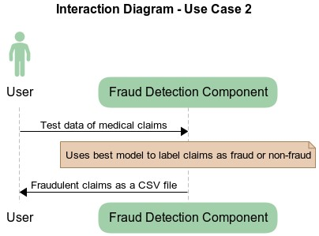
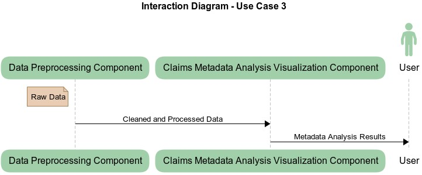

#### Software Components
* **Data Preprocessing Component**
    * ***What it does***: This component will handle the cleaning, normalization, and formatting of the input data. It will take in raw data from various sources, such as medical records, financial reports, and billing data, and preprocess the data so that it is compatible with the machine learning models used for anomaly detection.
    * ***Input***: Raw data from different sources.
    * ***Output***: Clean and formatted dataset ready for analysis.
* **Fraud Detection Component**
    * ***What it does***: This component is responsible for detecting anomalies or outliers in the preprocessed data. It takes in the preprocessed data and uses machine learning algorithms such as clustering, classification, and regression to identify patterns and anomalies in the data.
    * ***Input***: The preprocessed data
    * ***Output***: A list of flagged claims with a corresponding score or likelihood of fraud.
* **Fraud Detection Results Visualization Component**
    * ***What it does***: This component displays the results of the anomaly detection algorithm, including visualizations that show which claims are flagged as potentially fraudulent, as well as the overall performance of the different models (e.g., supervised vs. unsupervised). This allows the user to quickly identify potential fraud and assess the effectiveness of the different algorithms.
    * ***Input***: List of potentially fraudulent claims, model performance metrics, and user inputs to customize visualizations (e.g., which metrics to display).
    * ***Output***: The component provides visualizations that show the results of the anomaly detection algorithm, including plots that highlight potentially fraudulent claims and performance metrics that compare the different models. It may also provide options for exporting the visualizations or generating reports.
* **Claims Metadata Analysis Visualization Component**
    * ***What it does***: This component displays various visualizations that provide insights into the demographics of patients making claims, the types of claims being made, and any trends or patterns that may indicate potential fraud. The component can help the user identify areas where there may be higher risk of fraud and focus their investigations accordingly.
    * ***Input***: Pre-processed data including patient demographics, claim type, relevant metadata, user inputs to customize visualizations (e.g., specific year).
    * ***Output***: Visualizations showing various metrics related to patient demographics, claim type, and trends over time. Examples include bar, pie, and line charts.

#### Interactions to Accomplish Use Cases
- ***Use Case 1: Identifying High-Risk Claims for Review*** -- The Data Preprocessing Component takes in raw data from various sources and preprocesses it to make it compatible with the anomaly detection algorithm. The Fraud Detection Component takes in the preprocessed data and uses machine learning algorithms to identify patterns and anomalies in the data. The Fraud Detection Results Visualization Component takes in the results from the anomaly detection algorithm and generates visualizations that highlight potentially fraudulent claims and model performance metrics.

- ***Use Case 2: Prioritizing Claims for Payment Processing*** -- The Data Preprocessing Component takes in raw data from various sources and preprocesses it to make it compatible with the anomaly detection algorithm. The Fraud Detection Component takes in the preprocessed data and uses machine learning algorithms to identify patterns and anomalies in the data. Based on the results of the anomaly detection algorithm and the metadata analysis, the user can prioritize claims for payment processing.

- ***Use Case 3: Analyzing Medicare Claims through Visualization*** -- The Data Preprocessing Component takes in raw data from various sources and preprocesses it to make it compatible with the anomaly detection algorithm. The Claims Metadata Analysis Visualization Component takes in the preprocessed data and generates visualizations that provide insights into patient demographics, claim type, and trends over time. The user can interact with the visualizations to explore the data and identify potential fraud and abuse.

#### Preliminary Plan
- **Week 8**:
    * Finalize dataset for the analysis and fraud detection.
    * Decide which anomaly detection models to use and test them on the available dataset.
    * Prepare dashboard for the analysis of the prediction results for the different anomaly detection models.
    * Identify interesting patterns and prepare visualization to illustrate them.
- **Week 9**:
    * Complete preparing the dashboard which hosts both the models and the visualizations.
    * Create python package folder and test files.
    * Create Examples folder that contains examples of using the packages.
- **Week 10**:
    * Polish code to be PEP8 compliant and add appropriate documentation on how to use the tools.
    * Create README file that gives an overview of the project, LICENSE file and setup file that initializes the project after it has been cloned.
    * Create final project presentation.
    * Prepare demo for the final presentation.
- **Week 11**:
    * Final presentation and demo of the project on 14th March.

